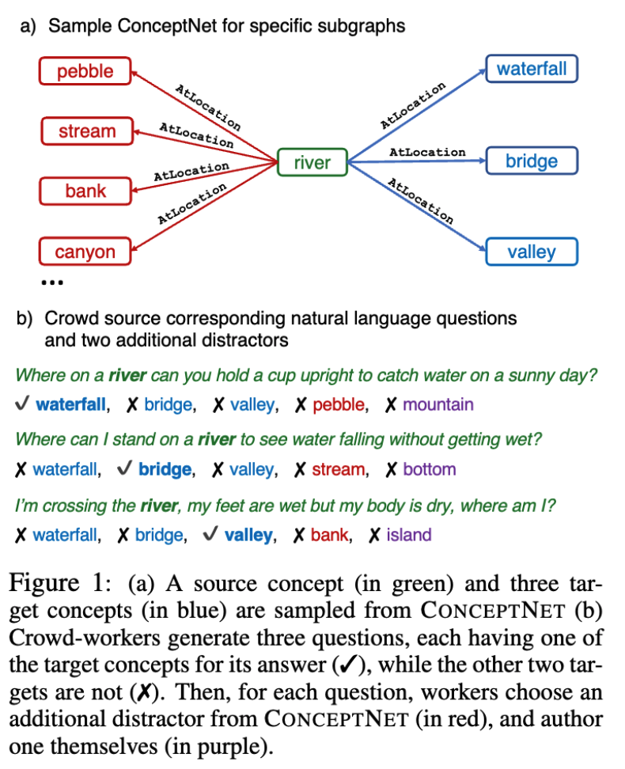

# commonsense_qa
- WSC와 같은 Common Sense용 벤치마크 들은 데이터가 너무 적음(CommonSenseQA 작업때까지만 해도 데이터들이 작았음)
- CONCEPTNET은 `(Concept1, Relation, Concept2)`의 그래프 형태를 가짐
- CommonSenseQA는 CONCEPTNET 데이터셋을 스케일링함
    - 그래프들에서 유사한 개념들을 뽑아서 다지선택의 문제로 만듦
    - Relation으로 연결된 Concept들을 1개의 Source, 3개의 Target으로 1개는 정답 2개는 오답인 컨셉으로 샘플링함
    - 작업자들은 직접 오답을 1개 작성하고 CONCEPTNET에서 다시 1개의 오답을 추가하여 총 5지 선다형의 문제를 생성  

---
+ **source**: huggingface
+ **hf_path**: tau/commonsense_qa
+ **url**: [https://huggingface.co/datasets/tau/commonsense_qa](https://huggingface.co/datasets/tau/commonsense_qa)  
+ **paper**: [https://arxiv.org/pdf/1811.00937](https://arxiv.org/pdf/1811.00937)  
