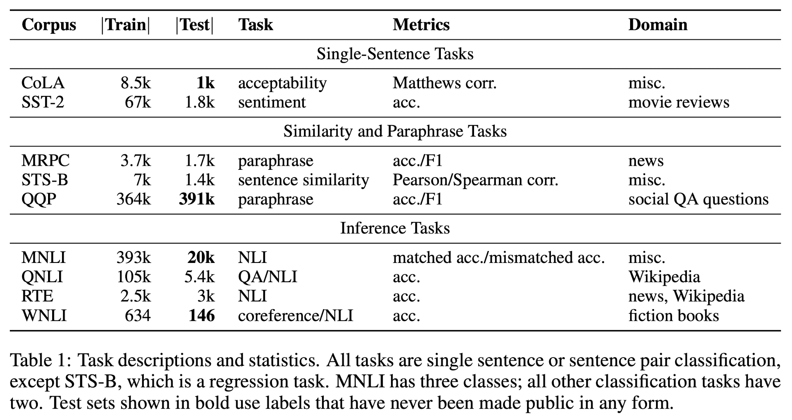

# glue
- General Language Understanding Evaludation Benchmark
- 다양한 NLU 평가를 포함함
    - 감정분석
    - QA
    - Textual Entailment
- 기존의 데이터셋을 기반으로 벤치마크를 만들었음
    - Single Sentence
        - `CoLA`: 언어 이론과 학술 논문에서 문법이 맞는지 주석으로 체크함
        - `SST-2`: 사람들의 감정을 주석으로 달아놓은 영화 리뷰
    - Similarity & Paraphrase : 문장의 유사도
        - `MRPC`: 뉴스에서 가져온 문장들이 의미적으로 동일한지
        - `QQP`: Quora에서 가져온 질문 Pair 데이터셋이 의미적으로 동일한지
        - `STS-B`: 뉴스 헤드라인, 비디오 자막, NLI 데이터에서 가져온 문장들이 의미적으로 동일한지
    - Inference : hypothesis가 Entailment / Neutral / Contradiction임을 구분
        - `MNLI`
        - `QNLI`: Wiki 기분 질문 데이터셋
        - `RTE`: Textual Entailment Challenge에서 가져옴
        - `WNLI`: WSC 기반 데이터셋
- qqp, mnli 등이 테스트셋이 많은 편이며, 보통 1만개 내외
- 데이터셋 및 Task별 Metric은 아래와 같음  

---
+ **source**: huggingface
+ **hf_path**: nyu-mll/glue
+ **hf_name**: 
    

        
Click

            
  -  <code>ax</code>

            
  -  <code>cola</code>

            
  -  <code>mnli_matched</code>

            
  -  <code>mnli_mismatched</code>

            
  -  <code>mnli</code>

            
  -  <code>mrpc</code>

            
  -  <code>qnli</code>

            
  -  <code>qqp</code>

            
  -  <code>rte</code>

            
  -  <code>sst2</code>

            
  -  <code>stsb</code>

            
  -  <code>wnli</code>

    

 
+ **url**: [https://huggingface.co/datasets/nyu-mll/glue](https://huggingface.co/datasets/nyu-mll/glue)  
+ **paper**: [https://openreview.net/pdf?id=rJ4km2R5t7](https://openreview.net/pdf?id=rJ4km2R5t7)  
