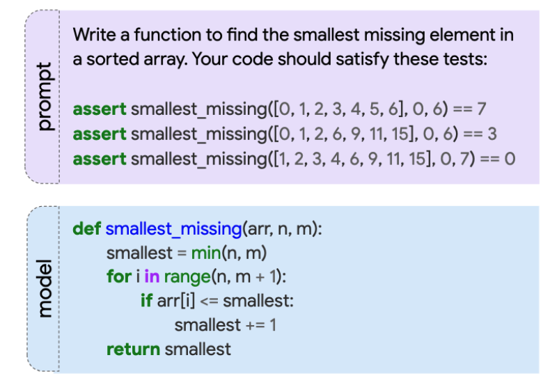

# mbpp
- Mostly Basic Programming Problems
- 구글에서 Programming 합성 문제를 측정하기 위한 2개의 벤치마크를 내놓음 - MBPP, MathQA-Python
- MBPP는 974개의 프로그래밍 과제로, 입문자 수준의 프로그래머는 해결 가능한 수준
    - 파이선 함수와 Text Description으로 구성됨
    - 루프, 조건문 등을 주로 다룸  
    
- 크라우드 소싱 및 수정 작업으로 이루어져 있으며, 수정본은 `sanitized` 버전으로 426개의 셋으로 제공됨
- HumanEval은 Docstring으로 프롬프트를 작성한 반면, MBPP는 자연어로 Description이 작성되어 있음
---
+ **source**: huggingface
+ **hf_path**: google-research-datasets/mbpp
+ **hf_name**: 
    

        
Click

            
  -  <code>sanitized</code>

    

 
+ **url**: [https://huggingface.co/datasets/google-research-datasets/mbpp](https://huggingface.co/datasets/google-research-datasets/mbpp)  
+ **paper**: [https://arxiv.org/pdf/2108.07732](https://arxiv.org/pdf/2108.07732)  
