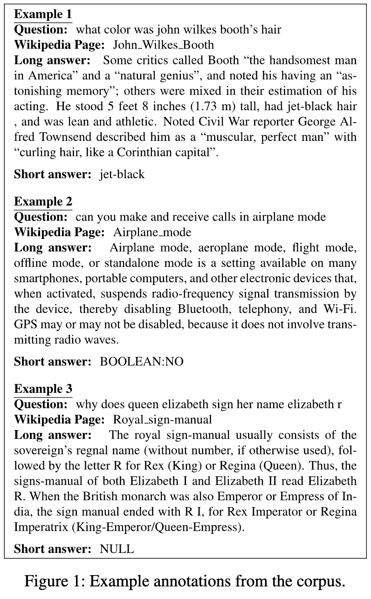

# natural_questions
- 익명의 구글 검색 결과, Wiki 페이지가 주어졌을 때, 짧은 답변, 긴 답변을 생성한 QA 벤치마크
- 30만개의 학습셋은 단일 주석처리, dev / test 셋은 5개의 주석처리가 되어 있음
- huggingface의 데이터셋 기준으로 `document` 컬럼의 길이가 매우 길어서 오버플로 발생
- 데이터셋 예시  

---
+ **source**: huggingface
+ **hf_path**: google-research-datasets/natural_questions
+ **hf_name**: 
    

        
Click

            
  -  <code>default</code>

            
  -  <code>dev</code>

    

 
+ **url**: [https://huggingface.co/datasets/google-research-datasets/natural_questions](https://huggingface.co/datasets/google-research-datasets/natural_questions)  
+ **paper**: [https://direct.mit.edu/tacl/article/doi/10.1162/tacl_a_00276/43518/Natural-Questions-A-Benchmark-for-Question](https://direct.mit.edu/tacl/article/doi/10.1162/tacl_a_00276/43518/Natural-Questions-A-Benchmark-for-Question)  
