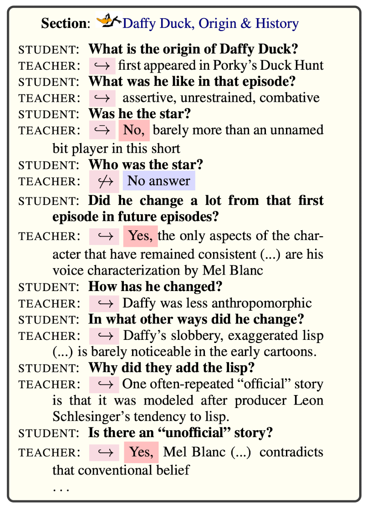

# QuAC
- Question Answering in Context
- Student는 지속적으로 Teacher에게 질문을하고, Teacher는 Context를 참조하여 답변하는 QA 벤치마크
    - Student는 Context에 접근하지 못하며, 개방된 질문을 계속한다
    - Teacher는 Context에 기반한 답변을 멀티턴으로 제공
- Training Set과 Test Set은 독립적으로 구성되어 있으며, Training Set은 멀티턴 대화로 구성되어 있음  

---
+ **source**: huggingface
+ **hf_path**: allenai/quac
+ **url**: [https://huggingface.co/datasets/allenai/quac](https://huggingface.co/datasets/allenai/quac)  
+ **paper**: [https://arxiv.org/pdf/1808.07036](https://arxiv.org/pdf/1808.07036)  
