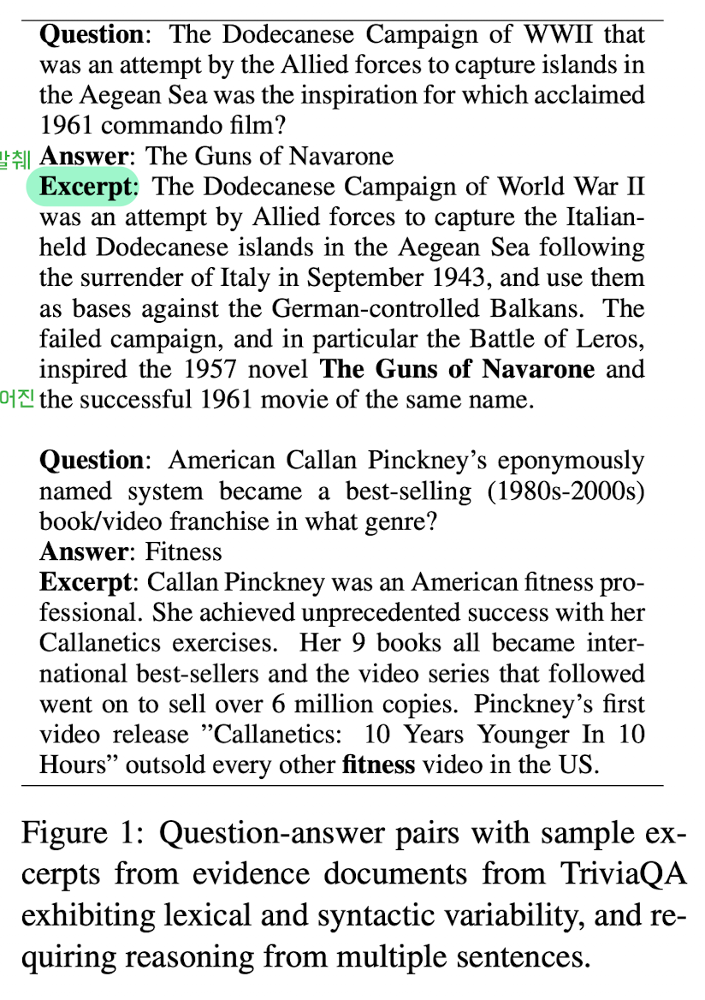

# trivia_qa
- TriviaQA는 Reading Comprehension 벤치마크
- 65만개의 (Question, Answer, Evidence) Triplet으로 이루어진 데이터셋 사용
    - 9.5만개의 Question - Answer Pair에서 각 Question마다 평균 6개의 Evidence를 추가
    - Evidence는 웹에서 검색한 결과 기반으로 사용하며, NLP Task와 독립적이기 때문에 Bias가 없음
- 14개의 trivia, quiz-league Web에서 Question, Answer를 수집
    - Wikipedia와 Bing 검색을 통해 Evidence를 추가하여 완성
- TAGME는 추가적인 Evidence를 Wikipedia와 연결하는 개체  

---
+ **source**: huggingface
+ **hf_path**: mandarjoshi/trivia_qa
+ **hf_name**: 
    

        
Click

            
  -  <code>rc</code>

            
  -  <code>rc.nocontext</code>

            
  -  <code>rc.web</code>

            
  -  <code>rc.web.nocontext</code>

            
  -  <code>rc.wikipedia</code>

            
  -  <code>rc.wikipedia.nocontext</code>

            
  -  <code>unfiltered</code>

            
  -  <code>unfiltered.nocontext</code>

    

 
+ **url**: [https://huggingface.co/datasets/mandarjoshi/trivia_qa](https://huggingface.co/datasets/mandarjoshi/trivia_qa)  
+ **paper**: [https://arxiv.org/pdf/1705.03551](https://arxiv.org/pdf/1705.03551)  
