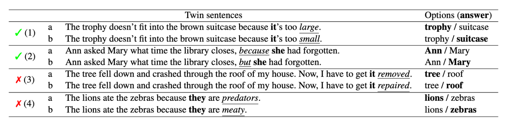

# winogrande
- WSC(Winogrande Schema Challenge)는 273개의 문제셋으로 이루어진 Common Sense 벤치마크
- WINOGRANDE는 WSC기반으로 44000개까지 문제셋을 늘린 Common Sense 벤치마크임
- `AFLITE` 알고리즘으로, CrowdWorker들의 Bias를 없앰
- WSC는 Twin Sentence를 보기로 주고 올바른 대명사를 고르는 문제임  

---
+ **source**: huggingface
+ **hf_path**: allenai/winogrande
+ **hf_name**: 
    

        
Click

            
  -  <code>winogrande_s</code>

            
  -  <code>winogrande_m</code>

            
  -  <code>winogrande_l</code>

            
  -  <code>winogrande_xl</code>

            
  -  <code>winogrande_debiased</code>

    

 
+ **url**: [https://huggingface.co/datasets/allenai/winogrande](https://huggingface.co/datasets/allenai/winogrande)  
+ **paper**: [https://arxiv.org/pdf/1907.10641](https://arxiv.org/pdf/1907.10641)  
